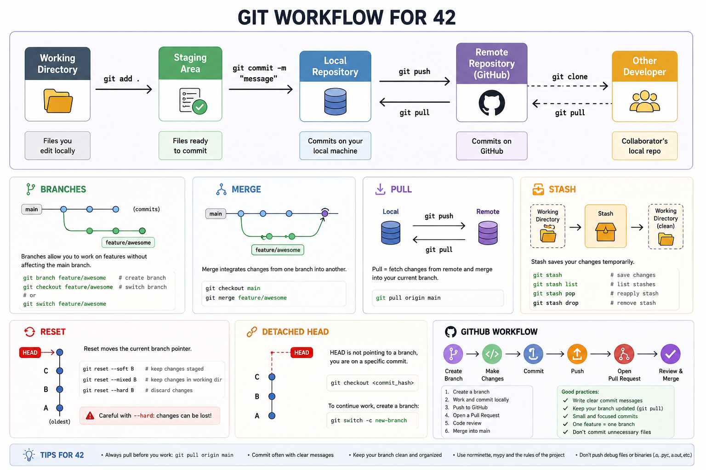

# Git Workflow for 42 School

A beginner-friendly guide to Git and GitHub workflows commonly used in 42 School projects.

This document explains:
- branches
- merge
- pull
- stash
- reset
- detached HEAD
- GitHub workflow
- common mistakes

Git is one of the most important tools for software development.



---

# What is Git?

Git is a version control system.

It tracks:
- code changes
- project history
- branches
- collaboration

Git allows developers to:
- work safely
- undo mistakes
- collaborate efficiently

---

# What is GitHub?

GitHub is an online platform that hosts Git repositories.

GitHub allows:
- remote backups
- collaboration
- pull requests
- code sharing

---

# Basic Git Workflow

Most workflows follow this pattern:

```text
Write code
→ git add
→ git commit
→ git push
```

---

# Repository

A repository (repo) stores:
- project files
- commit history
- branches

---

# Initializing a Repository

```bash
git init
```

Creates a local Git repository.

---

# Checking Repository Status

```bash
git status
```

One of the most important commands.

Shows:
- modified files
- staged files
- current branch

---

# Adding Files

```bash
git add file.py
```

Adds a file to the staging area.

---

# Add Everything

```bash
git add .
```

Stages all modified files.

---

# Commit

A commit is a saved snapshot of the project.

---

# Creating a Commit

```bash
git commit -m "Added BFS solver"
```

---

# Good Commit Messages

Good:

```text
Added config parser validation
```

Bad:

```text
fix
```

Clear messages improve project history.

---

# Branches

Branches allow separate development paths.

Useful for:
- new features
- experiments
- bug fixes

Without affecting the main project.

---

# Viewing Branches

```bash
git branch
```

---

# Creating a Branch

```bash
git branch feature-menu
```

---

# Switching Branches

```bash
git checkout feature-menu
```

---

# Modern Alternative

```bash
git switch feature-menu
```

---

# Create + Switch Together

```bash
git checkout -b feature-menu
```

or:

```bash
git switch -c feature-menu
```

---

# Why Branches Matter

Branches help:
- isolate work
- avoid breaking main
- support teamwork

Very important in 42 group projects.

---

# Merge

Merge combines branches together.

---

# Example Workflow

```text
main
└── feature-menu
```

After development:

```bash
git checkout main
git merge feature-menu
```

This brings:
- feature-menu changes
- into main

---

# Merge Conflicts

Conflicts happen when:
- two branches modify the same lines

Git cannot decide automatically.

---

# Conflict Example

```text
<<<<<<< HEAD
old code
=======
new code
>>>>>>> feature
```

You must:
- edit manually
- choose correct code
- remove conflict markers

---

# pull

`git pull` downloads updates from GitHub.

---

# Example

```bash
git pull
```

Equivalent to:

```bash
git fetch
git merge
```

---

# Why Pull Matters

Always pull before:
- pushing
- merging
- starting work

Especially in team projects.

---

# push

Uploads local commits to GitHub.

---

# Example

```bash
git push
```

---

# First Push of New Branch

```bash
git push -u origin feature-menu
```

---

# origin

`origin` usually means:
- the GitHub repository

---

# stash

`git stash` temporarily saves unfinished work.

Very useful when:
- changing branches
- pulling updates
- testing another branch

---

# Example

```bash
git stash
```

---

# Restoring Stash

```bash
git stash pop
```

---

# Viewing Stashes

```bash
git stash list
```

---

# reset

`git reset` moves commits or unstages changes.

Dangerous if used incorrectly.

---

# Unstage Files

```bash
git reset
```

---

# Reset to Previous Commit

```bash
git reset --hard HEAD~1
```

Removes:
- last commit
- changes permanently

Be careful.

---

# Soft Reset

```bash
git reset --soft HEAD~1
```

Removes commit:
- keeps file changes

Safer than `--hard`.

---

# Detached HEAD

A detached HEAD means:
- Git is not on a branch
- you are viewing a specific commit

---

# Common Cause

```bash
git checkout abc123
```

Where:
- `abc123` is a commit hash

---

# Why Detached HEAD is Dangerous

Commits made here may become lost.

---

# Fix Detached HEAD

Return to a branch:

```bash
git checkout main
```

or:

```bash
git switch main
```

---

# Clone Repository

Downloads a GitHub repository locally.

---

# Example

```bash
git clone https://github.com/user/project.git
```

---

# GitHub Workflow for 42

Common workflow:

---

# Step 1

Clone project:

```bash
git clone REPOSITORY_URL
```

---

# Step 2

Enter project:

```bash
cd project
```

---

# Step 3

Create branch:

```bash
git checkout -b sara-feature
```

---

# Step 4

Work normally.

---

# Step 5

Add files:

```bash
git add .
```

---

# Step 6

Commit:

```bash
git commit -m "Added MLX rendering"
```

---

# Step 7

Push branch:

```bash
git push -u origin sara-feature
```

---

# Step 8

Merge later into main.

---

# Common 42 Problems

---

# "Your branch has diverged"

Means:
- local and remote history differ

Usually fixed with:

```bash
git pull
```

or:
- merge/rebase

---

# "nothing to commit"

Means:
- no modified files exist

---

# Accidentally Working on main

Very common mistake.

Fix:
- create branch
- move work there

---

# Detached HEAD Confusion

Students often checkout commits directly.

Always verify current branch:

```bash
git branch
```

---

# Pull Before Push

Always:

```bash
git pull
git push
```

Especially in teams.

---

# Useful Commands Summary

| Command | Purpose |
|---|---|
| git status | View repository state |
| git add | Stage files |
| git commit | Save snapshot |
| git push | Upload to GitHub |
| git pull | Download updates |
| git branch | View branches |
| git checkout | Switch branches |
| git stash | Temporarily save work |
| git reset | Undo/reset changes |

---

# Recommended .gitignore

Do not upload:
- virtual environments
- cache files
- compiled Python files

---

# Example

```gitignore
venv/
__pycache__/
*.pyc
```

---

# Best Practices

- Commit frequently
- Use meaningful commit messages
- Pull before pushing
- Avoid working directly on main
- Use branches for features
- Verify branch before committing
- Avoid dangerous reset commands unless necessary

---

# Good Branch Names

Good:

```text
feature-menu
mlx-renderer
config-parser
```

Bad:

```text
test
stuff
aaa
```

---

# Final Notes

Git is an essential skill for modern software development.

Strong Git knowledge helps:
- teamwork
- debugging
- project organization
- safer development
- version tracking

Git becomes especially important in:
- 42 group projects
- MLX projects
- large codebases
- collaborative development

Understanding Git deeply will save countless hours during development.

---
