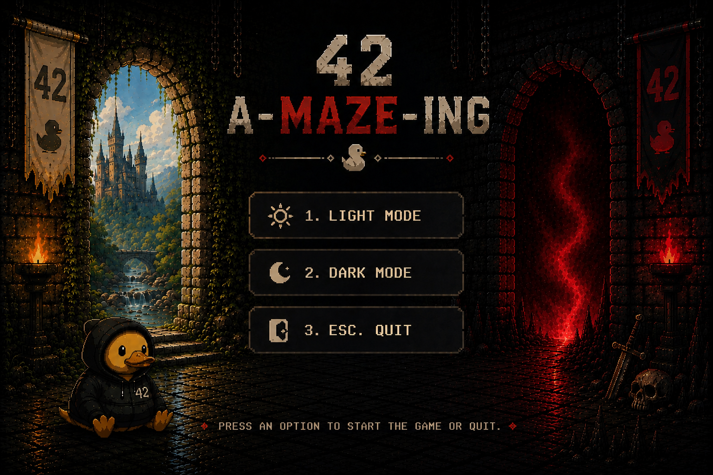

# A-Maze-ing Documentation

Welcome to the technical documentation for the **A-Maze-ing** project.

This documentation explains the internal systems used to generate, solve, render, and export mazes using Python and MiniLibX.

The project focuses on:
- Maze generation algorithms
- Pathfinding visualization
- Real-time rendering
- Interactive gameplay
- Reusable maze generation systems

---

<p align="center">
  
</p>

For more information about the maze project, visit the repository:
https://github.com/SaraFreitas-dev/A-Maze-ing

---

# 📚 Documentation Overview

Each document focuses on a specific part of the project architecture.

---

## 🧠 [Algorithms](algorithms.md)

Core maze generation and pathfinding systems.

### Topics Covered
- DFS maze generation logic
- BFS shortest-path solving
- Path reconstruction
- Explored cells for animation

### Main Files
- `mazegen/generator.py`
- `mazegen/solver.py`
- `mazegen/MazeGenerator.py`

---

## 🏗️ [Maze Generator](maze-generator.md)

Documentation for the reusable maze generation module.

### Topics Covered
- `MazeGenerator` class structure
- Maze object creation
- Generation pipeline
- Seed-based reproducibility
- Perfect and imperfect maze handling
- Integration between DFS, BFS, validation, and export

### Main Files
- `mazegen/MazeGenerator.py`
- `mazegen/Maze.py`

---

## 🖼️ [MLX Library](mlx-lib.md)

Overview of the MiniLibX integration used for graphical rendering.

### Topics Covered
- Window creation
- Image rendering
- Event hooks
- Keyboard controls
- Player movement
- Real-time updates
- Basic animation systems

### Main Files
- `render/mlx_renderer.py`
- `render/GameState.py`

---

## 📝 [Parsing System](parsing.md)

Configuration parsing and validation systems.

### Topics Covered
- KEY=VALUE parsing
- Required key validation
- Type conversion
- Duplicate key detection
- Error handling
- Maze configuration loading

### Main Files
- `parsing/config_parser.py`

---

## 🎨 [Render System](render.md)

Rendering and visual systems used in the project.

### Topics Covered
- ASCII rendering
- Maze drawing
- Asset loading
- Theme systems
- Menu rendering
- Dynamic scaling
- Animation rendering

### Main Files
- `render/draw_maze.py`
- `render/menu.py`
- `render/Assets.py`
- `render/converter.py`

---

## 📦 [Export System](export-system.md)

Maze export and utility systems.

### Topics Covered
- Hexadecimal maze export
- NSEW path conversion
- Output file structure
- Coordinate conversion
- Path processing
- Maze serialization

### Main Files
- `utils/export_utils.py`
- `utils/hex_utils.py`
- `utils/path_utils.py`

---

# 🏗️ Project Architecture

```text
A-Maze-ing
│
├── 🏗️ Maze Generator System
│   ├── Maze Object Structure
│   ├── Generation Pipeline
│   ├── Perfect / Imperfect Mazes
│   └── Seed Reproducibility
│
├── 🧠 Algorithms
│   ├── DFS Generation
│   ├── BFS Solving
│   ├── Pathfinding
│   └── Maze Validation
│
├── 🖼️ Rendering System
│   ├── MLX Window
│   ├── ASCII Renderer
│   ├── Theme System
│   └── Asset Management
│
├── 📝 Configuration System
│   ├── Config Parsing
│   ├── Validation
│   └── Error Handling
│
├── 📦 Export System
│   ├── Hexadecimal Export
│   ├── Path Conversion
│   └── File Output
│
└── 🎮 Gameplay Systems
    ├── Player Movement
    ├── Menu Navigation
    └── Interactive Rendering